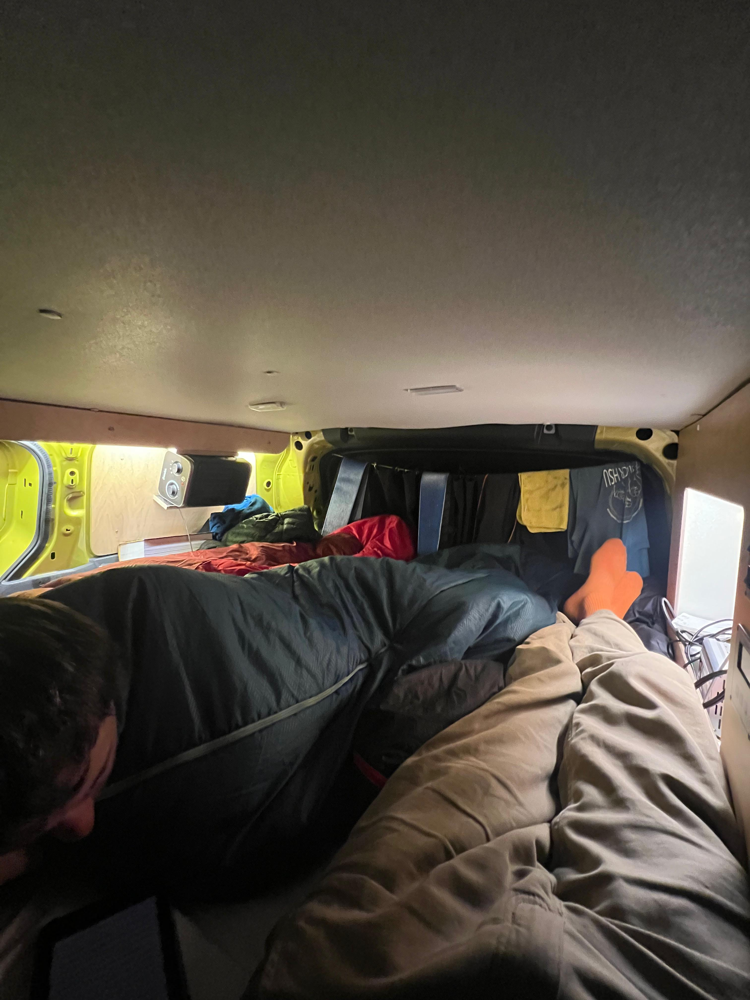
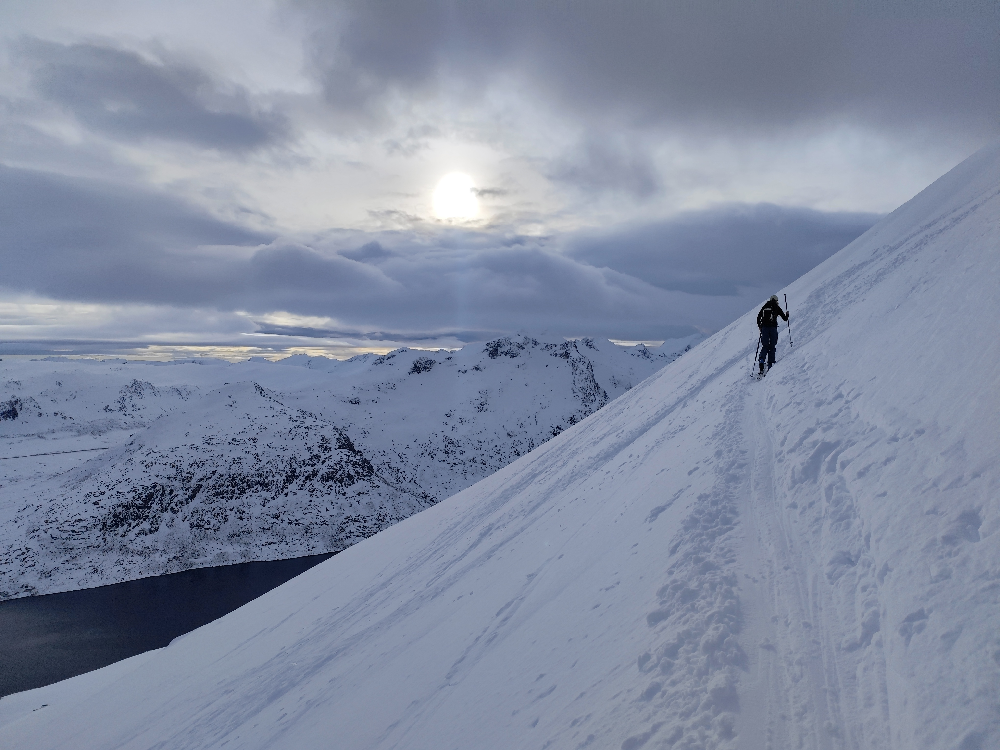
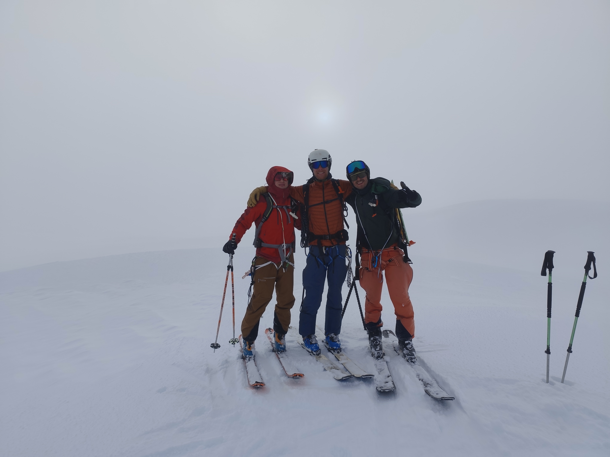
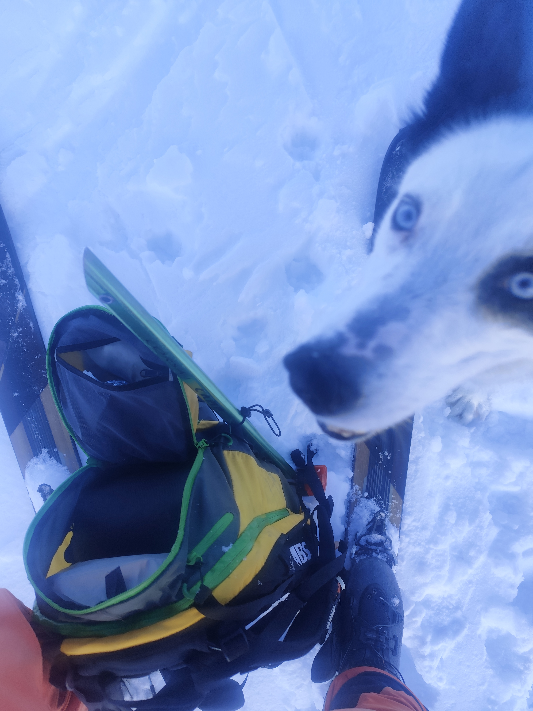
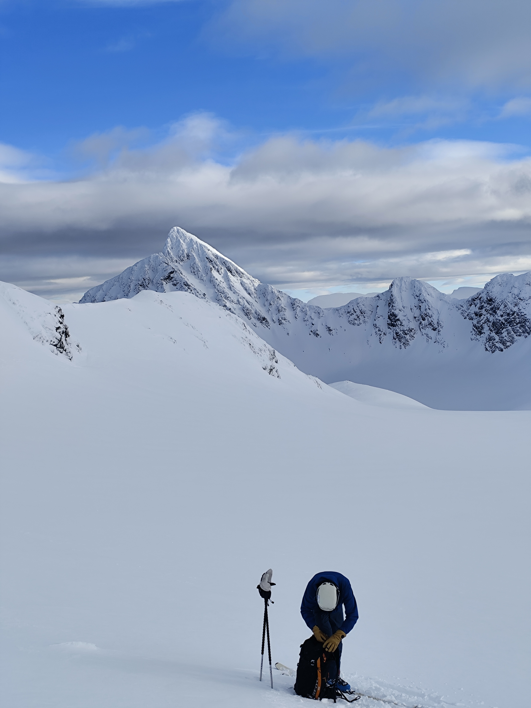

This was maybe the most memorable trip of my lifetime, only lasting 8 days. With my buddy Colin and brother Jacob, we explored the Lyngen Alps with an electric VW ID Buzz. The space was tight, but the advantage was that it kept us warm: 

Arriving late in Tromso, we where welcomed with green Northern Lights, not bad. 

Of course this adventure had it's shortcomings; some important ski mountaineering items where missing, we couln't refill our gas cartridges and the rear car door hit my head shortly before departure.. That said, the remaining experience was enormous. Our first "quick afternoon tour" already gave us a glimpse of the impressive nature: 

The best snow of the trip layed under our skis on the second day. We set out for **Holmbuktinden** despite bad weather and were rewarded big time. Two other parties set out for the same peak and after some strong winds and bad visibility, which allowed us to do one nice descend in the snow, there was finally a window for reaching the summit. 

On the descend, we could finally see in what crazy landscape we were in and enjoyed it big time:
.

The following days where characterized by strong winds and some rainfall. Not ideal for skitouring, but we could still choose some more mellow options in order to reach one summit every day. Also, we met the fittest dog imaginable in my mind: while skinning up in a good pace to Fastdalstinden, a split boarder overtook us with his Husky-like dog basically pulling him up the mountain. The animal looked like not weighing over 40kg and extremly stron. We talked to him and he confirmed that the dog made him a lot faster in the uphill: 

The same night, we where again rewarded with Northern Lights, very impressive. The next two days included another two great tours. First, we summited Storgalten and skied the West Couloir, where the cover picture of this blog was taken. Another great scenria was the glacier we had to cross to enter the West face: 
Storgalten is definetly a peak I want to come back to, as there are numerous delicoulsly looking couloirs on its West face, which we could not do due to both time and avalanche constraints. The same evening we went to the hut DNT Jægervasshytta. A French duo who had just done a long multi day hut tour gave us some beta for our plans on the final day; We wanted to do one long couloir to finnish of the trip. The entry point to the valley on the next day was spicy: ice and steep slopes (45 degree) required us to use carmpons to enter the valley. Once inside, we could see big lines left and right as far the eyes can see. However, avy conditions where not optimal; the North-West side was dangoursly windloaded. Our first attempt for a South couloir was not succesfull; it was either icy or had massive drift snow. So we headed to the lower part of the valley to find a more wind-protected line and finnaly found it. Jacob went first with impressive speed, making a big track the whole couloir upwards. On top, we were on a Nikolai Schirmer -like ridge:

We were just in time for a nice sunny descent, of course only after testing the snow stability, in our case Colin did so being roped on.

It's hard to describe the skiing only in words in images, so I made a video of our trip, it's available [here](https://youtu.be/eDoZkGmJuYA?is=qVEc6O8cDTkzH02I).