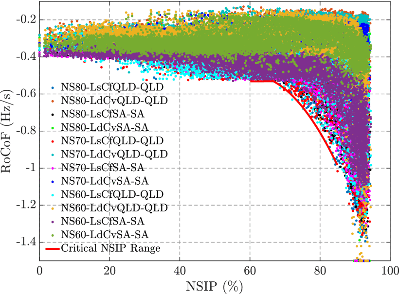
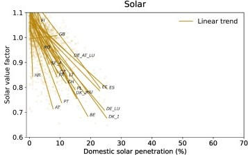
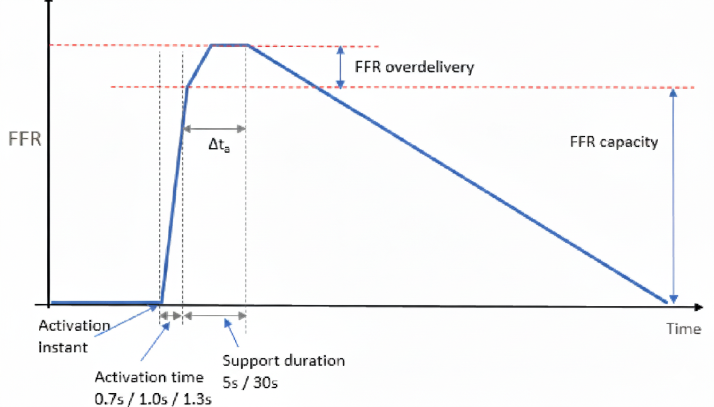
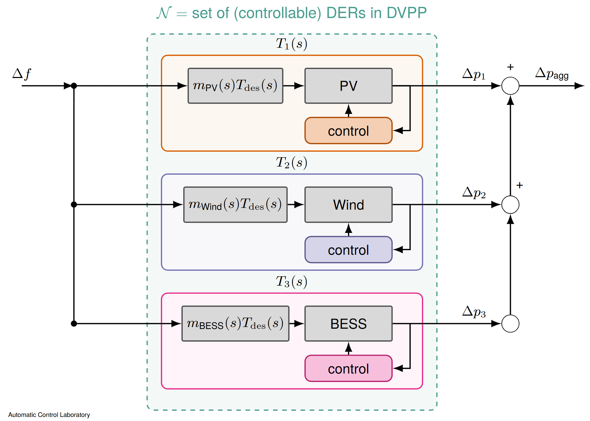
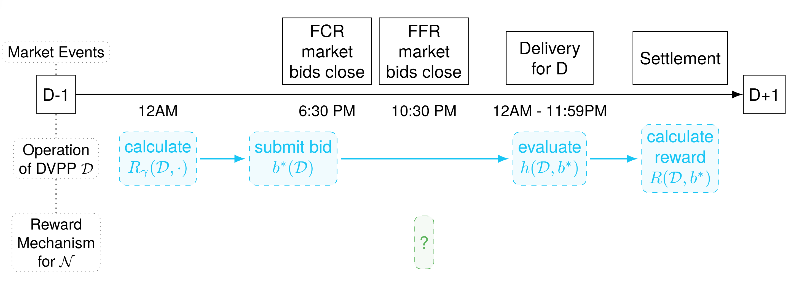
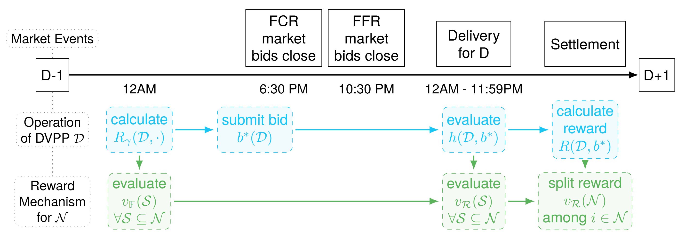
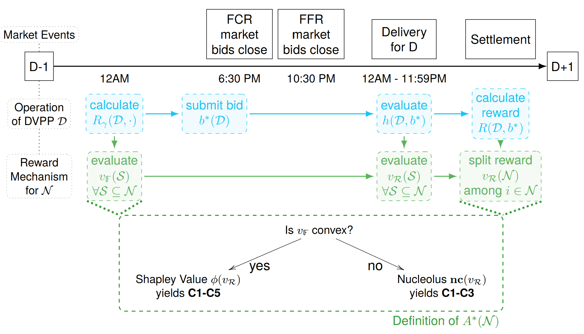
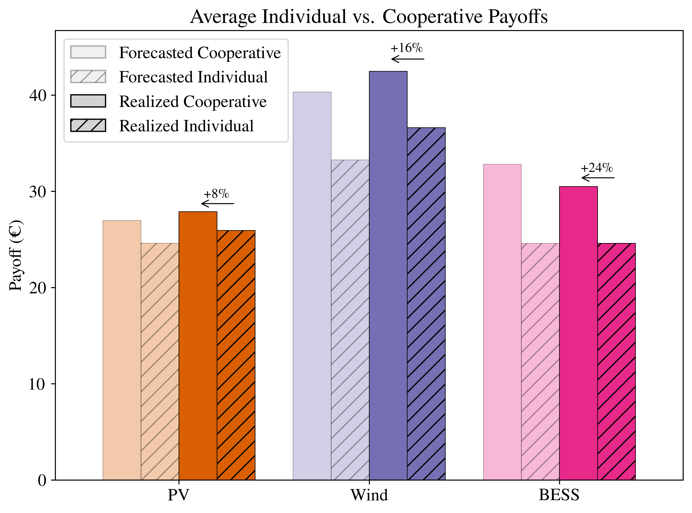

*This blog post is a shortend and more blog-like version of my Master Thesis. The full text Master Thesis is available [here](https://drive.google.com/file/d/1pCPoJt1C8YLEp0EDTyXuijjh6lYNsOHB/view?usp=sharing).*

The global transition toward renewable energy is moving forward for good economic and environmental reasons, but during my master's research, I focused on two significant technical and economic challenges it presents. First, as synchronous power plants get replaced with distributed energy resources, power grids have a lower inertia, meaning faults lead to alrger instantenous frequency deviations. Second, renewables market values (e.g. wind and solar PV) is decreasing as their share of production grows.

*Figure from Ahmadyar et al., 2018, shows decreasing inertia.*

*Figure from Hirth, 2013, displays decreasing market value of Solar PV.*

The proposed technical solution lies in cooperative aggregation to provide services that boost the system inertia. These services are called *Dynamic Ancillary Services (DAS)*. By networking heterogeneous Distributed Energy Resources (DERs) together, we can create a Dynamic Virtual Power Plant (DVPP) which can provide exactly these ervices. Together, the DERs leverage their complementary technical capabilities.

For this proposal to work, there are two main requirements:
1. Technical feasibility (a collection of
DERs is able to provide the DAS)
2. Economic & Cooperative feasibility (collective DAS provision is beneficial
for every DER)
The main challenge is to ensure that the DERs are capable of DAS provision but also ensuren 

### Dynamic Ancillary Service (DAS)

DAS are characterized by *fast* ancillary services, such as Fast Frequency Reserve (FFR), Frequency Containment Reserve for Disturbances (FCR-D), and voltage control. These operate in multiple countries with high penetrations of renewables, such as Australia, Ireland and the Nordic Countries in Europe. Individual DERs are often ineffective in providing DAS. However, a specific aggregation of DERs named a Dynamic Virtual Power Plant (DVPP) can provide DAS [as shown by previous research.](https://ieeexplore.ieee.org/abstract/document/9667320/) Below is the requirement curves for Fingrid's FFR service, employed in this thesis.

## Dynamic Virtual Power Plant (DVPP) Control Design

The goal is to provide DAS with a set of DERs. Given an activation signal $\Delta f(s)$, we formulate the desired power deviation $T_\mathrm{des}(s)$ and split the desired transfer function into local transfer functions $T_i(s)$:
$$\Delta p_{\mathrm{des}}
        = T_\mathrm{des}(s)
        \Delta f(s)$$
$$\Delta p_{i} (s)= T_i(s) \Delta f(s).$$
We use a DER-specific Adaptive Dynamic Participation Factor (ADPF) $m_i(s)$ to encode each DER's role in the DVPP:
$$T_i(s) = m_i(s) \cdot T_\mathrm{des}(s), \quad\forall i\in \mathcal{D}$$
The ADPF roles may for example include Low-pass, Band-pass, and High-pass filters. It is important to match the desired transfer function:
$$ \sum_{i\in\mathcal{D}}m_i(s) \overset{!}{=} 1$$

## DVPP Control Design in Action

The DVPP studied in this Thesis has the following control design:

<video width="640" height="480" controls>
  <source src="../../assets/latex_praesentation/pics/videos/ANI_simulation_data_FFR_+_FCR-D_PV+Wind+BESS_on_12_4_2025_at_11_.mp4" type="video/mp4">
  Your browser does not support the video tag.
</video>

## Timeline

Now we move to a market setting where we embed the prviously presented control design is integrated into a market setting. First, we have to quantify the worth of a DVPP in the market. Consider a set of DERs $\mathcal{N}$ and a DVPP $\mathcal{D}$ operating in the Dynamic Ancillary Service Market:

where $R_\gamma(\mathcal{D},b) = b(\mathcal{D})\cdot[\pi \gamma_{\mathcal{D}}(b) - q (1-\gamma_{\mathcal{D}}(b))]$ is the (forecasted) probalistic reward (the reward $\mathcal{D}$ can expect when placing a bid $b$) with the pass probability $\gamma_{\mathcal{D}}(b)$, $b^*(\mathcal{D})\leftarrow \arg\max_{b} R_\gamma(\mathcal{D},b)$ is the optimal bid placed in the market, $h(\mathcal{D},b) \xrightarrow{\text{simulate bid activation}} \{\text{fail, pass}\}$ evaluates whether the DVPP is succesful delivering the bid and
$$R(\mathcal{D}, b) =
        \begin{cases}
            \pi\cdot b(\mathcal{D}), & \text{if } h(\mathcal{D},b) = \text{pass}\\
            -q\cdot b(\mathcal{D}) & \text{if } h(\mathcal{D},b) = \text{fail}
        \end{cases}$$
is the realized reward.

### Quantify Value of DERs

Now we move to the Game Theory part of the cooperation by asking: How much is each set of DERs (coalitions $S$) worth? I introduce the **Forecasted** and **Realized Value** to quantify this:
$$v_\mathbb{F}(\mathcal{S}) = \sum_{\mathcal{D}\in P^*(\mathcal{S})} R_\gamma(\mathcal{D}, b^*(\mathcal{D})$$
$$v_\mathcal{R}(\mathcal{S})= \sum_{\mathcal{D}\in P^*(\mathcal{S})} R(\mathcal{D}, b^*(\mathcal{D}))$$
where $P^*(\mathcal{S})$ is the optimal partition of coalition $\mathcal{S}$.

Now we have all the ingredients to formulate a reward allocation based on the following timeline:

### Cooperation Criteria

To define a suitable Reward Allocation
    $$A^*(\mathcal{N}):v_\mathcal{R}(\mathcal{N})\rightarrow[x_i]_{i\in\mathcal{N}}$$
we introduce a crucial set of cooperation criteria:
* **C1: Rationality & Coalitional Stability**
* **C2: Bayesian Incentive Compatibility**
* **C3: Optimality & Feasibility**
* **C4: Fairness**
* **C5: Ex-Post Consistency**

### Proposed Reward Allocation

The final proposed Reward Allocation looks as follows:

To satisfy the largest set of criteria possible, two methods where employed in my Thesis.

* **The Shapley Value:** When the assets have a positive network effect, meaning the marginal returns increase as the set of DERs grows and denoted as a "convex game"—the Shapley Value is the ideal approach. It distributes the reward based strictly on the average marginal contribution of each asset. It ensures that individual effort is proportionally rewarded on a level playing field, satisfying the condition of fairness.
* **The Nucleolus:** Sometimes, there is only a small or no incentive to cooperate and no convex game. In this case, the Nucleolus minimizes the maximum dissatisfaction for all DERs, such that no DER wants to leave the cooperation. It calculates the payout by lexicographically maximizing the excess of the most dissatisfied coalition. While it sacrifices some linearity and fairness compared to the Shapley Value, it guarantees stability by ensuring no DER is incentivized to leave the grand coalition.

### The Real-World Test: The Finnish Grid

To prove this framework practically, I simulated its operation on the Finnish power grid, utilizing historical data for their fast frequency reserve markets. 

My simulated DVPP included:
* A 21.6 MW Wind power plant.
* A 15 MW Solar PV plant.
* A 15 MW Battery Energy Storage System (BESS).

Operating a DVPP in this market is high-stakes; failing to deliver the promised capacity results in a severe penalty that is three times the potential reward.

### The Results: Better Together

The simulation proved my hypothesis: cooperation is highly effective. Operating together as a DVPP yielded 16% higher revenue compared to the assets operating completely on their own:

The BESS emerged as the most significant beneficiary of this teamwork. Because of its extremely fast response times, it earned a reward that exceeded its standalone value by 40%. Meanwhile, the solar and wind plants benefited considerably from the battery compensating for production shortfalls when the wind died down or clouds rolled in, saving them from massive financial penalties.

### The Ultimate Coalition

Writing this thesis taught me that as our grid becomes highly renewable, we cannot rely on individual assets operating in silos. They must act as a coordinated, dynamic system. But control engineering alone isn't enough; the economic incentives have to align.

Ironically, I experienced the power of a "grand coalition" firsthand while writing this. Teaming up with my incredible supervisors—Verena, Saverio, and Florian—boosted my own "payoff" from confusion to clarity. Without them, my standalone value would have been much lower! 