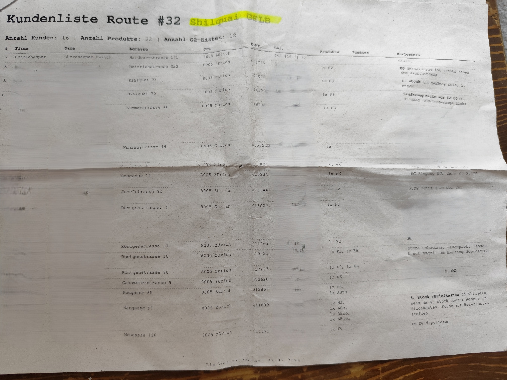

*Die Applikation ist [hier verfügbar!](https://oepfel.cvonholly.cc/)*

Montag, 5 Uhr aufstehen. Über die Hardturmbrücke düsen. Obstkörbe packen. Ausliefern bis um 13 Uhr. Ab in die Vorlesung. Klingt spassig? Find ich auch! Als Velokurier bei Öpfelchasper sehen meine Montage seit knapp zwei Jahren so aus. Ich finde es eine erfüllende und spassige Arbeit, die Strassen Zürichs mit dem Velo und grossen Anhängern zu beliefern. Und das Team ist einfach toll, man hilft sich, wo man kann, und plant coole Sachen.

Die Routenfindung läuft analog über Ausfahrscheine. An sich ist das legitim, alle Stopps und Besonderheiten sind aufgelistet und eine grobe Karte auf der Rückseite kann die Routen anzeigen.

Jedoch kennt man natürlich nicht jede Adresse auswendig und muss manchmal mühselig einzelne in Google Maps eintippen. Vor allem bei schlechtem Wetter kann dies schmerzhaft sein. Daher habe ich mir überlegt, diesen Prozess von der analogen zur digitalen Route zu automatisieren.

### Die Idee: Vom Papier direkt in Google Maps

Das Ziel war simpel: Ich wollte eine Web-Applikation bauen, die ich morgens kurz auf dem Handy öffne. Ein Klick, ein Foto vom Ausfahrschein, und wenige Sekunden später öffnet sich automatisch die Google Maps App mit der perfekt sortierten Route und allen Wegpunkten. Keine zusätzliche App-Installation, kein manuelles Abtippen.

Um das zu erreichen, musste ich drei Herausforderungen lösen:
1. Den Text vom Papier lesen (OCR).
2. Die echten Adressen aus dem ganzen Textsalat herausfiltern.
3. Die Google Maps Limitierungen umgehen.

### Der Tech-Stack: Leichtgewichtig und Serverless

Da die App vor allem schnell und mobil funktionieren muss, habe ich auf schwere Frontend-Frameworks verzichtet. Die gesamte Anwendung – sowohl das User Interface als auch das sichere Backend für die API-Keys – läuft über ein einziges **Cloudflare Worker** Skript.

### Schritt 1 & 2: Wenn OCR fast *zu* gut funktioniert

Für die Bilderkennung nutze ich die **Google Cloud Vision API**. Sie ist unglaublich präzise und erkennt selbst schwer lesbare Schrift oder schiefe Fotos bei schlechtem Licht zuverlässig. 

Hier stieß ich jedoch auf das erste große Problem: Ein Ausfahrschein besteht nicht nur aus Adressen. Da stehen Überschriften, Seitenzahlen, Kundennamen, Hinweise wie "Korb bitte vor die Tür stellen" oder Kaffeeflecken. Wenn man diesen gesamten rohen Text einfach an Google Maps schickt, bricht die Routenplanung komplett zusammen.

**Die "Secret Sauce": KI als Filter**
Anstatt hunderte Zeilen komplexer Regulärer Ausdrücke (Regex) zu schreiben, um irgendwie Strassennamen zu finden, jage ich den rohen OCR-Text durch **Google Gemini 2.5 Flash**. 

Ich gebe dem LLM (Large Language Model) einen strikten Prompt: *"Du bist ein Daten-Extraktor. Finde nur die echten Adressen im Text. Ignoriere alles andere. Gib mir exakt ein sauberes JSON-Array zurück."* Das funktioniert magisch. Gemini sortiert den ganzen Lärm aus und übergibt meinem Code eine perfekte, maschinenlesbare Liste der Adressen in der exakt richtigen Reihenfolge.

### Schritt 3: Das Google Maps 10-Stopp-Limit austricksen

Mit der fertigen Adressliste baut der Code eine offizielle Google Maps URL zusammen (`http://googleusercontent.com/maps.google.com/...`), die den Browser zwingt, direkt die native Karten-App auf iOS oder Android zu öffnen. 

Hier wartete die letzte Hürde: Google erlaubt in diesen kostenlosen, universellen URLs **maximal 10 Stopps** (1 Start, 8 Wegpunkte, 1 Ziel). Ein voller Liefer-Run hat aber oft deutlich mehr Stopps. 

Die Lösung ist ein **intelligentes Batching**. Wenn die Kamera mehr als 10 Adressen erkennt, teilt die App die Route automatisch in Blöcke auf und generiert grüne Buttons ("Route Part 1", "Route Part 2"). 

Das Wichtigste dabei: **Die Routen überlappen sich.** Die Logik geht in 9er-Schritten vorwärts, sodass die Zieladresse von Teil 1 exakt die Startadresse von Teil 2 ist. Wenn ich also meine ersten 10 Lieferungen beendet habe, drücke ich einfach auf den nächsten Button und fahre nahtlos von meinem aktuellen Standort weiter. Kein Suchen, kein Überlegen, wo ich stehen geblieben bin.

### Ein kleines Schloss vor der Tür

Da die Cloudflare Worker URL öffentlich im Netz steht, könnte theoretisch jeder die App nutzen und meine Google API-Limits aufbrauchen. Anstatt aber ein riesiges Login-System mit Datenbank und Passwörtern zu bauen, habe ich einfach ein simples Passcode-Feld in das Frontend eingebaut. Nur wer das Codewort kennt (meine Arbeitskollegen und ich), kommt am Backend vorbei zu den APIs. Simpel, aber extrem effektiv gegen Bots.

### Fazit

Was als Idee begann, um kalte Finger an regnerischen Montagmorgen zu vermeiden, ist zu einem super praktischen Tool geworden. Es zeigt schön, wie man mit modernen Serverless-Technologien (Cloudflare) und zielgerichtetem KI-Einsatz (Gemini für Daten-Formatierung) alltägliche, analoge Prozesse mit wenigen Zeilen Code extrem vereinfachen kann.

Jetzt heisst es nur noch: Foto machen, aufs Velo steigen und Äpfel ausliefern! 🍏🚲